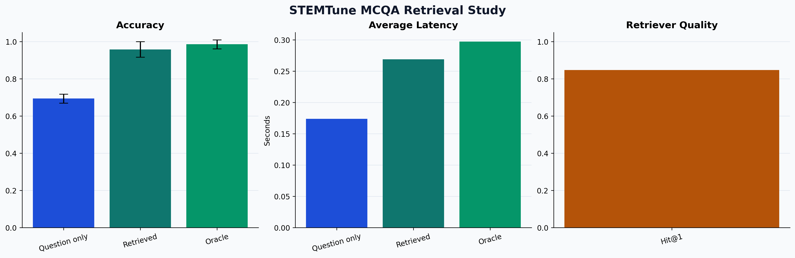
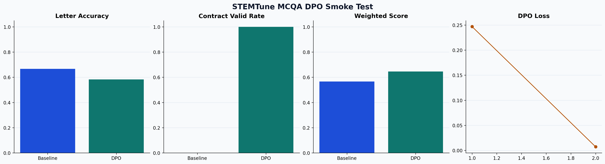
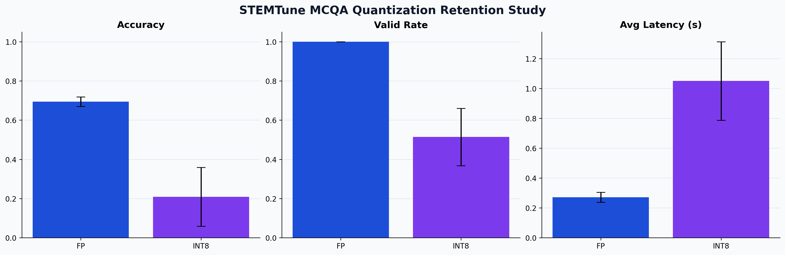

# STEMTune

`STEMTune` is a lightweight framework for selecting, adapting, and evaluating open-source LLMs for task-specific QA systems.

It is useful when a base model is close to usable, but still needs one of these steps before deployment:

- post-training to learn a target behavior
- retrieval to answer with external evidence
- preference alignment to shape outputs
- deployment checks to see whether quantization is safe

## What It Lets You Do

- choose a model for `sft`, `mcqa`, `dpo`, `quantization`, or `rag`
- scaffold a clean project with configs and manifests
- run small public-dataset studies before committing real GPU budget
- reuse the underlying training, retrieval, and compression recipes

## When It Is Useful

- you need structured outputs from an open model and want to verify that post-training really fixes the behavior
- you want to know whether RAG will help before building a larger retrieval stack
- you want to test whether a quantized deployment still preserves task quality
- you want to compare SFT-style adaptation vs preference alignment on the same task

## Fastest Demo

The main smoke test is `posttrain-mcqa`.

It runs a tiny LoRA post-training job on the public [allenai/sciq](https://hf.co/datasets/allenai/sciq) dataset and evaluates a strict machine-readable MCQA contract:

```text
<final>
choice=<A|B|C|D>
source=question_only
</final>
```

Run:

```bash
python -m stemtune posttrain-mcqa \
  --train-limit 32 \
  --eval-limit 24 \
  --epochs 4 \
  --batch-size 4 \
  --learning-rate 5e-5 \
  --max-new-tokens 64 \
  --output-dir docs/results/mcqa_posttrain_smoke
```

Tracked result:

- letter accuracy: `0.667 -> 0.750`
- strict accuracy: `0.000 -> 0.750`
- contract valid rate: `0.000 -> 1.000`
- weighted score: `0.567 -> 0.788`

Artifacts:

- [docs/results/mcqa_posttrain_smoke/report.md](docs/results/mcqa_posttrain_smoke/report.md)
- [docs/results/mcqa_posttrain_smoke/summary.json](docs/results/mcqa_posttrain_smoke/summary.json)


## Built-In Studies

### RAG Lift

```bash
python -m stemtune study-rag --limit 24 --seeds 7,11,13 --corpus-size 500
```

Tracked result:

- question only: `0.694`
- retrieved support: `0.958`
- oracle support: `0.986`
- retriever hit@1: `0.847`

[docs/results/mcqa_rag_retrieval/report.md](docs/results/mcqa_rag_retrieval/report.md)



### DPO Smoke

```bash
python -m stemtune dpo-mcqa --train-limit 32 --eval-limit 24 --epochs 2 --batch-size 2 --learning-rate 5e-5 --max-new-tokens 64
```

Tracked result:

- weighted score: `0.567 -> 0.646`
- contract valid rate: `0.000 -> 1.000`

[docs/results/mcqa_dpo_smoke/report.md](docs/results/mcqa_dpo_smoke/report.md)



### Quantization Check

```bash
python -m stemtune study-quantization --condition plain --limit 24 --seeds 7,11,13
```

Tracked local result on this backend:

- full precision accuracy: `0.694`
- dynamic int8 accuracy: `0.208`
- latency worsened instead of improving

This is still a useful result: STEMTune is meant to catch unsafe deployment shortcuts, not just confirm positive ones.

[docs/results/mcqa_quantization_retention/report.md](docs/results/mcqa_quantization_retention/report.md)



## Quickstart

```bash
python -m stemtune list-tasks
python -m stemtune show-task mcqa
python -m stemtune recommend --task mcqa --gpu-memory-gb 24
python -m stemtune init-project --name "Biomedical MCQA" --task mcqa --base-model Qwen/Qwen3-8B --hf-namespace your-name --output-dir ./workspaces
```

## Practical Cases

- structured medical or scientific assistants that must emit parseable answers
- QA systems that need retrieval before full RAG engineering
- small-model deployment where quantization risk must be measured, not assumed
- alignment experiments where you want to compare post-training and DPO on one task

## Repo Map

- `stemtune/`: CLI and framework layer
- `training/`: SFT, MCQA, DPO, quantization, and RAG recipes
- `retrieval/`: knowledge-base preparation scripts
- `configs/`: reference configs
- `cluster/`: SLURM launchers for GPU-backed runs
- `docs/results/`: tracked benchmark artifacts

## Next Docs

- framework commands: [stemtune/README.md](stemtune/README.md)
- alignment playbook: [docs/open-source-alignment-playbook.md](docs/open-source-alignment-playbook.md)
- cluster usage: [cluster/README.md](cluster/README.md)
