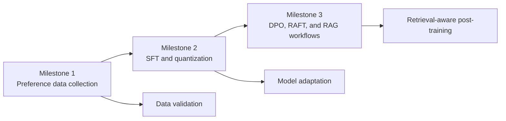
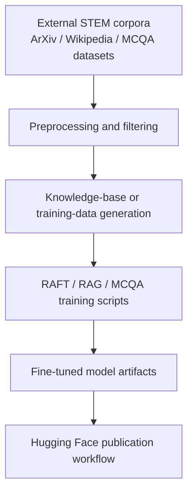

# Modern NLP Coursework Portfolio

This repository curates three micro-projects completed for the EPFL `CS-552` Modern NLP course into a single portfolio-oriented codebase.

The work evolves across three milestones:

1. `project-m1-2025-veme`: preference data collection, annotation support, and literature-review deliverables.
2. `project-m2-2025-veme`: post-training experiments on STEM question-answering tasks, including supervised fine-tuning and quantization.
3. `project-m3-2025-veme`: more advanced training workflows covering DPO, MCQA adaptation, RAFT/RAG data generation, and knowledge-base preparation.

## Why This Repo Exists

The original projects were created as separate GitHub Classroom repositories. That structure was fine for course submission, but weak for a public portfolio:

- the READMEs were course-instruction heavy rather than outcome focused;
- several scripts assumed local machine paths or contained secrets that should never be published;
- large artifacts and generated data would make the public repository noisy and heavy;
- the technical story was fragmented across three different repos.

This umbrella repository is meant to fix that by making the work readable, safer to publish, and easier to evaluate as an NLP/LLM engineering portfolio.

## Project Progression

## Repository Map

### Milestone 1: Data And Evaluation Setup

`project-m1-2025-veme` contains the earliest project work:

- preference-data collection notebooks and JSON exports;
- submission validators and report templates;
- annotation assets used during the manual labeling workflow.

From a portfolio perspective, this milestone shows data curation, annotation, and evaluation discipline more than model engineering.

### Milestone 2: Post-Training And Quantization

`project-m2-2025-veme` focuses on model adaptation for STEM question answering:

- supervised fine-tuning scripts;
- quantization and QLoRA experiments;
- Hugging Face model configuration files;
- evaluation-support datasets and report materials.

This milestone is the bridge from coursework infrastructure to actual model experimentation.

### Milestone 3: DPO, RAG, And Data Generation

`project-m3-2025-veme` is the most technically interesting section:

- DPO training code;
- MCQA training and dataset unification pipelines;
- RAFT/RAG dataset generation;
- retrieval knowledge-base preprocessing for ArXiv and Wikipedia STEM corpora;
- model upload and Hugging Face integration utilities.

This is the part of the portfolio that most clearly signals LLM post-training, retrieval workflows, and data-pipeline work.

## Example Advanced Workflow

The most interesting engineering pattern in this repository is the milestone 3 retrieval-oriented training pipeline.

## Key Improvements Applied In This Curated Version

- Replaced hardcoded API tokens in Python scripts with environment-variable based configuration.
- Removed reliance on machine-specific `os.chdir(...)` paths from the main quantization scripts.
- Rewrote the milestone READMEs to explain what the code does instead of repeating course submission instructions.
- Added a repository audit and publishing plan in [docs/repo-audit.md](/Users/emanuelerimoldi/Documents/GitHub/MNLP/docs/repo-audit.md).
- Added a root `.gitignore` tailored for turning this folder into a single public repository.

## Environment Variables

Some scripts now expect credentials to come from the environment instead of source code:

- `HF_TOKEN`
- `HF_USERNAME`
- `HF_MODEL_REPO_ID`
- `HF_MODEL_REPO_NAME`
- `HF_DATASET_REPO_ID`
- `HF_DATASET_REPO_NAME`
- `MNLP_GPT_WRAPPER_API_KEY`

Not every script uses every variable; the names are intentionally generic so the workflows are easier to reuse.

## Provenance

The original work was produced across three separate GitHub Classroom repositories. This repository republishes the code in a unified structure so the technical progression is easier to evaluate. The detailed audit and consolidation notes are in [docs/repo-audit.md](/Users/emanuelerimoldi/Documents/GitHub/MNLP/docs/repo-audit.md).

## What A Recruiter Should Notice

- practical experience with LLM post-training workflows, not only model usage;
- hands-on work with dataset cleaning, annotation, and training data construction;
- exposure to quantization, DPO, and retrieval-augmented training ideas;
- familiarity with Hugging Face tooling and experiment-oriented scripting.

The codebase still reflects its academic origin, but it now presents a much clearer narrative: from data creation, to fine-tuning, to more advanced preference and retrieval methods.
