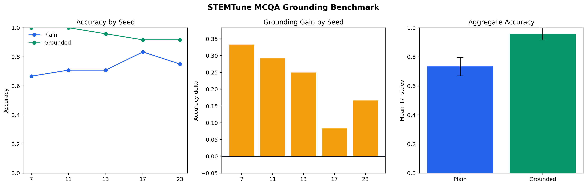
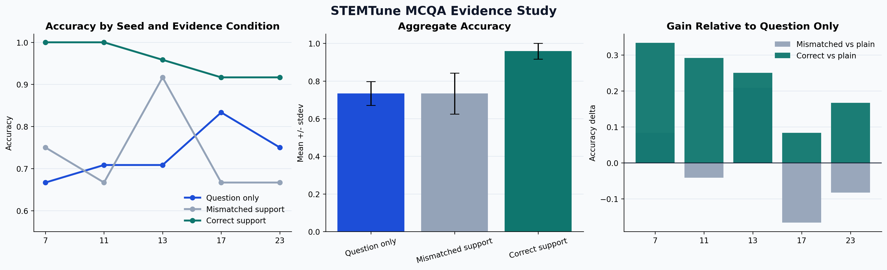
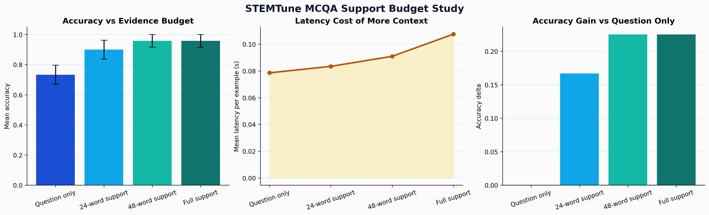
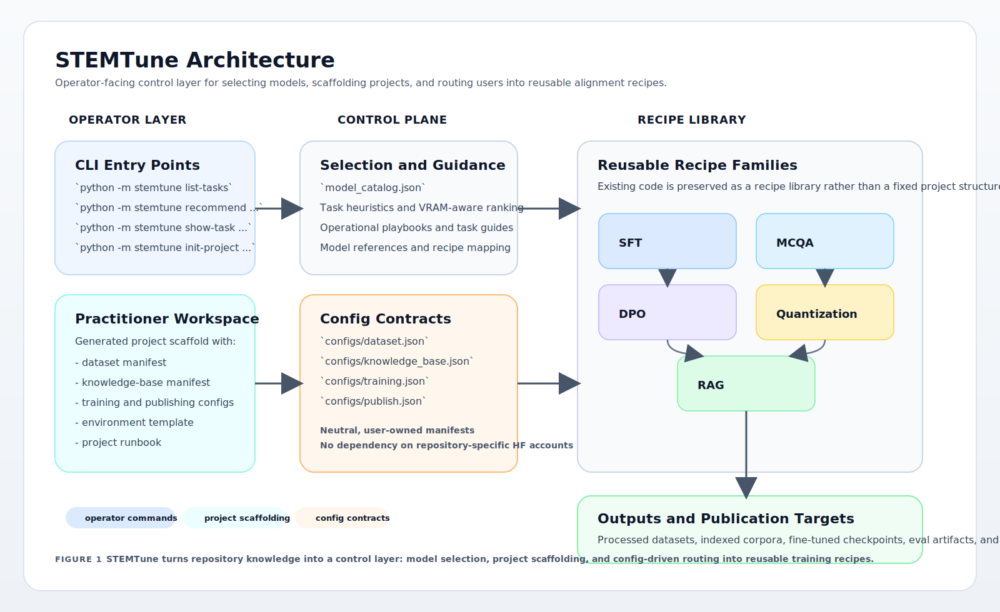
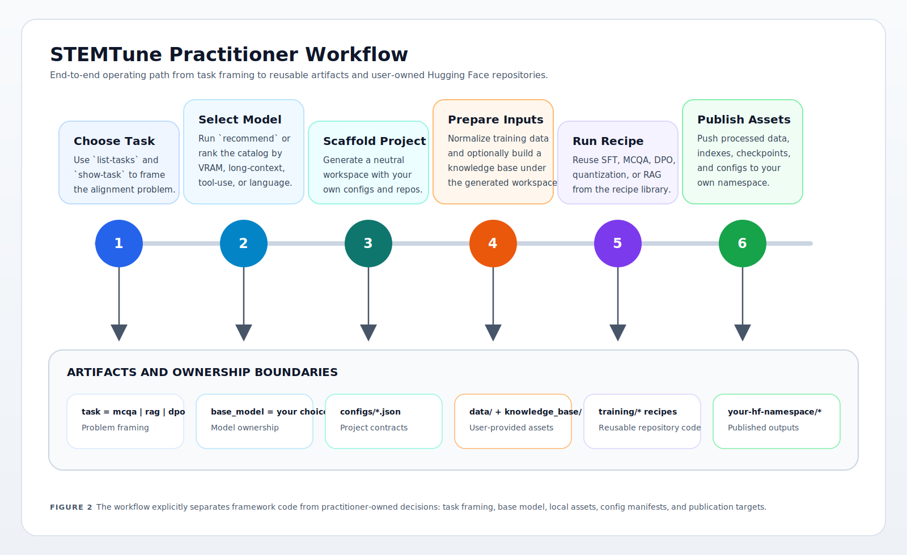

# STEMTune: LLM Post-Training Recipes

Small open models often fail not because they are unusable, but because they are asked to answer blind.

STEMTune packages a practical answer to that problem: select the right open model, scaffold a clean adaptation project, and verify that simple grounding or post-training moves the metric in the right direction before you spend serious GPU budget.

The repository bundles reusable recipes for adapting LLMs to STEM question-answering workloads with:

- supervised fine-tuning;
- multiple-choice adaptation;
- direct preference optimization;
- quantization and QLoRA;
- retrieval-oriented training and knowledge-base preparation.

This repository is organized as a cohesive engineering codebase. The emphasis is on reusable scripts, clear folder boundaries, and explicit handling of large external datasets.

## What This Repository Is For

This codebase is useful if you want to study or reuse compact training pipelines for:

- turning base models into task-specific QA models;
- building MCQA training data and evaluation-ready prompts;
- running DPO-style alignment experiments;
- compressing or fine-tuning smaller Qwen-family models;
- preparing corpora for retrieval-augmented training.

The repository has been restructured into a single engineering-focused layout with a lightweight control layer on top of the underlying training recipes.

## Evidence First

The repository now includes a public benchmark that demonstrates a concrete improvement on a real task.

With `Qwen/Qwen2.5-0.5B-Instruct` on `allenai/sciq`, the same model was evaluated in two conditions over `120` public MCQA examples:

- question only: `73.3%` mean accuracy;
- grounded with the support passage: `95.8%` mean accuracy;
- mean improvement: `+22.5` accuracy points.

Artifacts are tracked in [docs/results/mcqa_grounding_qwen25_0p5b/report.md](docs/results/mcqa_grounding_qwen25_0p5b/report.md), [docs/results/mcqa_grounding_qwen25_0p5b/summary.json](docs/results/mcqa_grounding_qwen25_0p5b/summary.json), and the plot below.



Two follow-up studies turn that benchmark into something operational:

- relevance ablation: mismatched support does not improve the score, while correct support lifts the same model from `73.3%` to `95.8%`;
- support-budget study: `48` support words recover the full-support accuracy of `95.8%` while cutting mean latency from `0.107s` to `0.091s`.

Artifacts are tracked in [docs/results/mcqa_evidence_study/report.md](docs/results/mcqa_evidence_study/report.md) and [docs/results/mcqa_support_budget_qwen25_0p5b/report.md](docs/results/mcqa_support_budget_qwen25_0p5b/report.md).





## STEMTune

`STEMTune` is the lightweight framework layer shipped with this repository.

Its goal is simple:

- help you choose a credible open-source starting model;
- map a task to the right alignment recipe in this repo;
- keep the workflow practical for single-GPU or small multi-GPU setups.

If you want the fastest way to operate the repository, start here:

```bash
python -m stemtune --task mcqa --gpu-memory-gb 24
python -m stemtune --task dpo --gpu-memory-gb 24 --prefer-multilingual
python -m stemtune --task rag --gpu-memory-gb 48 --prefer-long-context --prefer-tool-use
python -m stemtune list-models --task mcqa --gpu-memory-gb 24
python -m stemtune show-task quantization
python -m stemtune benchmark-mcqa --model-id Qwen/Qwen2.5-0.5B-Instruct --limit 24 --seeds 7,11,13,17,23
python -m stemtune study-mcqa --models Qwen/Qwen2.5-0.5B-Instruct --limit 24 --seeds 7,11,13,17,23
python -m stemtune study-support-budget --model-id Qwen/Qwen2.5-0.5B-Instruct --limit 24 --seeds 7,11,13,17,23
```

See [stemtune/README.md](stemtune/README.md) and [docs/open-source-alignment-playbook.md](docs/open-source-alignment-playbook.md).

## How To Use STEMTune

`STEMTune` is meant to answer three operational questions quickly:

1. Which open-source model should I start from?
2. Which alignment recipe matches my task?
3. Which folder do I open first?

The command surface is intentionally small:

```bash
python -m stemtune list-tasks
python -m stemtune show-task mcqa
python -m stemtune list-models --task rag --gpu-memory-gb 48 --prefer-long-context
python -m stemtune recommend --task sft --gpu-memory-gb 16
python -m stemtune init-project --name "Biomedical MCQA" --task mcqa --base-model Qwen/Qwen3-8B --hf-namespace your-name --output-dir ./workspaces
python -m stemtune smoke-mcqa --limit 12 --output-dir artifacts/evals/smoke_mcqa
python -m stemtune benchmark-mcqa --model-id Qwen/Qwen2.5-0.5B-Instruct --limit 24 --seeds 7,11,13,17,23
python -m stemtune study-mcqa --models Qwen/Qwen2.5-0.5B-Instruct --limit 24 --seeds 7,11,13,17,23
python -m stemtune study-support-budget --model-id Qwen/Qwen2.5-0.5B-Instruct --limit 24 --seeds 7,11,13,17,23
```

This makes the repository usable as a lightweight framework rather than as a static code drop.

## Runnable Smoke Test

The repository now includes a public smoke test built around [allenai/sciq](https://hf.co/datasets/allenai/sciq).

It compares the same open model under two conditions:

- `plain`: answer from the question alone;
- `grounded`: answer using the provided support passage.

Run:

```bash
python -m stemtune smoke-mcqa --limit 12 --output-dir artifacts/evals/smoke_mcqa
```

The command emits structured results and a plot so you can quickly inspect whether grounding improved accuracy for that run.

If you want a less noisy signal, run the multi-seed benchmark instead:

```bash
python -m stemtune benchmark-mcqa --model-id Qwen/Qwen2.5-0.5B-Instruct --limit 24 --seeds 7,11,13,17,23
```

This emits an aggregate report, per-seed metrics, and a benchmark plot under `docs/results/` by default.

If you want the more convincing ablations, run:

```bash
python -m stemtune study-mcqa --models Qwen/Qwen2.5-0.5B-Instruct --limit 24 --seeds 7,11,13,17,23
python -m stemtune study-support-budget --model-id Qwen/Qwen2.5-0.5B-Instruct --limit 24 --seeds 7,11,13,17,23
```

These produce two additional tracked result folders:

- `docs/results/mcqa_evidence_study/`: correct support vs mismatched support ablation;
- `docs/results/mcqa_support_budget_qwen25_0p5b/`: context-budget sweep for the same model and task.

## Bring Your Own Assets

The framework is not tied to any fixed repository namespace, dataset naming scheme, or Hub profile.

You can now bootstrap a clean project scaffold that contains your own:

- dataset manifest;
- knowledge-base manifest;
- training config;
- evaluation and promotion config;
- publishing config;
- environment template;
- project runbook.

Use:

```bash
python -m stemtune init-project \
  --name "Your Project Name" \
  --task rag \
  --base-model meta-llama/Meta-Llama-3.1-8B-Instruct \
  --hf-namespace your-name \
  --output-dir ./workspaces
```

This creates a neutral workspace with config files and no dependency on repository-specific artifacts. See [docs/project-bootstrap.md](docs/project-bootstrap.md).

## Where STEMTune Fits

There are strong adjacent projects in the ecosystem, but they solve different slices of the problem:

- [alignment-handbook](https://github.com/huggingface/alignment-handbook): alignment-focused recipes for preference training and evaluation.
- [torchtune](https://github.com/meta-pytorch/torchtune): a PyTorch-native post-training library.
- [LitGPT](https://github.com/Lightning-AI/litgpt): broad pretrain, finetune, evaluate, and deploy workflows with config-driven recipes.
- [OpenRLHF](https://github.com/OpenRLHF/OpenRLHF): scalable RLHF and agentic RL infrastructure.
- [Axolotl](https://github.com/axolotl-ai-cloud/axolotl): general fine-tuning stack for many open models.

STEMTune should not try to outgrow those systems feature-for-feature. Its stronger direction is:

- task-aware routing from problem type to the right adaptation path;
- model selection under explicit hardware and deployment constraints;
- project scaffolding that defines data, knowledge-base, training, evaluation, and publishing contracts;
- promotion gates that decide when a model is good enough to publish, compress, or extend with retrieval.

This is the direction that makes the framework more distinct than a generic recipe collection. A short positioning note is in [docs/landscape.md](docs/landscape.md).

## Repository Layout

```text
.
├── cluster/      SLURM wrappers for GPU-backed benchmarks
├── configs/      model and submission-style configuration snapshots
├── datasets/     lightweight tracked datasets, calibration data, and data builders
├── docs/         usage notes, landscape analysis, and framework guidance
├── reports/      selected write-ups and deliverables
├── retrieval/    knowledge-base preparation scripts
├── stemtune/     model selection and operational guidance layer
└── training/     SFT, DPO, MCQA, quantization, and RAG recipes
```

## Training Surface



## Folder Guide

### `datasets/`

Contains small tracked assets and builder scripts:

- `preference/`: example preference data from the early annotation stage;
- `calibration/`: small calibration data used by quantization workflows;
- `metadata/`: lightweight metadata snapshots for published datasets;
- `builders/`: scripts for DPO data generation and MCQA dataset preparation.

Large raw datasets are intentionally excluded from git. See [datasets/README.md](datasets/README.md) for the expected local layout.

### `training/`

Grouped by learning recipe instead of by assignment milestone:

- `sft/`: supervised fine-tuning variants;
- `mcqa/`: multiple-choice QA specialization scripts;
- `dpo/`: preference optimization training and evaluation;
- `quantization/`: compression and QLoRA experiments;
- `rag/`: retrieval-aware training recipes and alternative RAFT-style experiments.

See [training/README.md](training/README.md).

### `retrieval/`

Preparation utilities for external corpora used in retrieval-oriented experiments:

- ArXiv filtering and upload workflows;
- Wikipedia STEM corpus chunking and publication helpers.

See [retrieval/README.md](retrieval/README.md).

### `stemtune/`

The operator-facing layer of the repository:

- `select_stack.py`: choose a model family and recipe from task and hardware constraints;
- `model_catalog.json`: curated open-source model profiles;
- `README.md`: quickstart and selection guidance.

This is the shortest path from “I have a task” to “I know which recipe to run”.

### `configs/`

Structured configuration snapshots for different model variants and submission stages. These files are useful as a reference when reproducing model packaging or checking the exact Hugging Face repository naming used during experiments.

See [configs/README.md](configs/README.md).

### `cluster/`

Minimal SLURM wrappers for sending the benchmark to a GPU queue. Start with [cluster/README.md](cluster/README.md).

### `reports/`

Contains selected written artifacts that complement the code. The repository is code-first, but keeping one representative report helps document the modeling choices and experimental context.

## Example Workflow



## Operational Quickstart

If your goal is to align an open-source model to one of the tasks covered here:

1. Pick a task: `sft`, `mcqa`, `dpo`, `quantization`, or `rag`.
2. Run `python -m stemtune show-task <task>` to confirm that the recipe matches your use case.
3. Run `python -m stemtune --task <task> --gpu-memory-gb <budget>` to choose a model.
4. Run `python -m stemtune init-project ...` to generate your own manifests and configs.
5. Put your raw assets inside the generated project workspace rather than inside repository-specific folders.
6. Start from the recommended recipe folder under `training/`.

The practical playbook is in [docs/open-source-alignment-playbook.md](docs/open-source-alignment-playbook.md).

## Model Selection Heuristics

Use this as the default routing logic before you specialize further:

| If you need... | Default choice | Why |
|---|---|---|
| Cheap debugging and smoke tests | `Qwen/Qwen3-0.6B` | Small enough to validate data pipelines and training code quickly |
| Best default single-GPU post-training base | `Qwen/Qwen3-8B` | Strong general-purpose open-source starting point for SFT, MCQA, and DPO |
| Mature assistant-style ecosystem and long context | `meta-llama/Meta-Llama-3.1-8B-Instruct` | Strong tooling ecosystem and 128k context window |
| Heavier retrieval or tool-rich local serving | `mistralai/Mistral-Small-3.1-24B-Instruct-2503` | Better fit for long-context, tool-aware, retrieval-heavy setups |

## Environment Variables

Several scripts use environment variables instead of hardcoded credentials:

- `HF_TOKEN`
- `HF_USERNAME`
- `HF_MODEL_REPO_ID`
- `HF_MODEL_REPO_NAME`
- `HF_DATASET_REPO_ID`
- `HF_DATASET_REPO_NAME`
- `MNLP_GPT_WRAPPER_API_KEY`

Not every script uses every variable, but the naming is consistent across the repository.

## Notes On Data Availability

This repository intentionally does not version large local datasets, intermediate Arrow files, model checkpoints, or generated artifacts.

When a script expects local input such as `MathQA`, `GPQA`, or custom MCQA corpora, the expected paths are documented in [datasets/README.md](datasets/README.md). This keeps the repository lightweight while preserving reproducible code structure.
