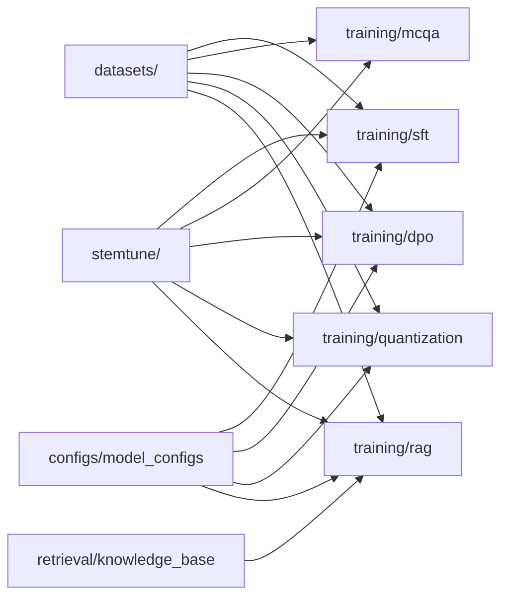
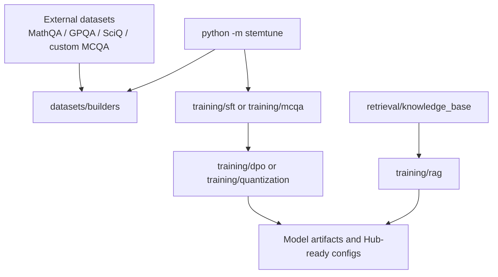

# STEMTune: LLM Post-Training Recipes

Practical training recipes for adapting LLMs to STEM question-answering workloads with:

- supervised fine-tuning;
- multiple-choice adaptation;
- direct preference optimization;
- quantization and QLoRA;
- retrieval-oriented training and knowledge-base preparation.

This repository is organized as a cohesive practitioner codebase rather than a course archive. The emphasis is on reusable scripts, clear folder boundaries, and explicit handling of large external datasets.

## What This Repository Is For

This codebase is useful if you want to study or reuse compact training pipelines for:

- turning base models into task-specific QA models;
- building MCQA training data and evaluation-ready prompts;
- running DPO-style alignment experiments;
- compressing or fine-tuning smaller Qwen-family models;
- preparing corpora for retrieval-augmented training.

The scripts were originally developed in the context of a graduate NLP project, but the repository has been restructured into a single engineering-focused layout.

## STEMTune

`STEMTune` is the lightweight framework layer shipped with this repository.

Its goal is simple:

- help you choose a credible open-source starting model;
- map a task to the right alignment recipe in this repo;
- keep the workflow practical for single-GPU or small multi-GPU setups.

If you want the fastest way to operate the repository, start here:

```bash
python -m stemtune --task mcqa --gpu-memory-gb 24
python -m stemtune --task dpo --gpu-memory-gb 24 --prefer-multilingual
python -m stemtune --task rag --gpu-memory-gb 48 --prefer-long-context --prefer-tool-use
python -m stemtune list-models --task mcqa --gpu-memory-gb 24
python -m stemtune show-task quantization
```

See [stemtune/README.md](/Users/emanuelerimoldi/Documents/GitHub/MNLP/stemtune/README.md) and [docs/open-source-alignment-playbook.md](/Users/emanuelerimoldi/Documents/GitHub/MNLP/docs/open-source-alignment-playbook.md).

## How Practitioners Use STEMTune

`STEMTune` is meant to answer three operational questions quickly:

1. Which open-source model should I start from?
2. Which alignment recipe matches my task?
3. Which folder do I open first?

The command surface is intentionally small:

```bash
python -m stemtune list-tasks
python -m stemtune show-task mcqa
python -m stemtune list-models --task rag --gpu-memory-gb 48 --prefer-long-context
python -m stemtune recommend --task sft --gpu-memory-gb 16
python -m stemtune init-project --name "Biomedical MCQA" --task mcqa --base-model Qwen/Qwen3-8B --hf-namespace your-name --output-dir ./workspaces
```

This makes the repository usable as a lightweight framework rather than as a static code drop.

## Bring Your Own Assets

The framework is no longer tied to the original course repositories, namespaces, or Hub profiles.

Practitioners can now bootstrap a clean project scaffold that contains their own:

- dataset manifest;
- knowledge-base manifest;
- training config;
- publishing config;
- environment template;
- project runbook.

Use:

```bash
python -m stemtune init-project \
  --name "Your Project Name" \
  --task rag \
  --base-model meta-llama/Meta-Llama-3.1-8B-Instruct \
  --hf-namespace your-name \
  --output-dir ./workspaces
```

This creates a practitioner-owned workspace with neutral config files and no dependency on the original MNLP course artifacts. See [docs/practitioner-automation.md](/Users/emanuelerimoldi/Documents/GitHub/MNLP/docs/practitioner-automation.md).

## Repository Layout

```text
.
├── configs/      model and submission-style configuration snapshots
├── datasets/     lightweight tracked datasets, calibration data, and data builders
├── docs/         project notes and historical provenance
├── reports/      selected write-ups and deliverables
├── retrieval/    knowledge-base preparation scripts
├── stemtune/     model selection and operational guidance layer
└── training/     SFT, DPO, MCQA, quantization, and RAG recipes
```

## Training Surface



## Folder Guide

### `datasets/`

Contains small tracked assets and builder scripts:

- `preference/`: example preference data from the early annotation stage;
- `calibration/`: small calibration data used by quantization workflows;
- `metadata/`: lightweight metadata snapshots for published datasets;
- `builders/`: scripts for DPO data generation and MCQA dataset preparation.

Large raw datasets are intentionally excluded from git. See [datasets/README.md](/Users/emanuelerimoldi/Documents/GitHub/MNLP/datasets/README.md) for the expected local layout.

### `training/`

Grouped by learning recipe instead of by assignment milestone:

- `sft/`: supervised fine-tuning variants;
- `mcqa/`: multiple-choice QA specialization scripts;
- `dpo/`: preference optimization training and evaluation;
- `quantization/`: compression and QLoRA experiments;
- `rag/`: retrieval-aware training recipes and alternative RAFT-style experiments.

See [training/README.md](/Users/emanuelerimoldi/Documents/GitHub/MNLP/training/README.md).

### `retrieval/`

Preparation utilities for external corpora used in retrieval-oriented experiments:

- ArXiv filtering and upload workflows;
- Wikipedia STEM corpus chunking and publication helpers.

See [retrieval/README.md](/Users/emanuelerimoldi/Documents/GitHub/MNLP/retrieval/README.md).

### `stemtune/`

The operator-facing layer of the repository:

- `select_stack.py`: choose a model family and recipe from task and hardware constraints;
- `model_catalog.json`: curated open-source model profiles;
- `README.md`: quickstart and selection guidance.

This is the shortest path from “I have a task” to “I know which recipe to run”.

### `configs/`

Structured configuration snapshots for different model variants and submission stages. These files are useful as a reference when reproducing model packaging or checking the exact Hugging Face repository naming used during experiments.

See [configs/README.md](/Users/emanuelerimoldi/Documents/GitHub/MNLP/configs/README.md).

### `reports/`

Contains selected written artifacts that complement the code. The repository is code-first, but keeping one representative report helps document the modeling choices and experimental context.

## Example Workflow



## Operational Quickstart

If your goal is to align an open-source model to one of the tasks covered here:

1. Pick a task: `sft`, `mcqa`, `dpo`, `quantization`, or `rag`.
2. Run `python -m stemtune show-task <task>` to confirm that the recipe matches your use case.
3. Run `python -m stemtune --task <task> --gpu-memory-gb <budget>` to choose a model.
4. Run `python -m stemtune init-project ...` to generate your own manifests and configs.
5. Put your raw assets inside the generated project workspace rather than inside course-specific folders.
6. Start from the recommended recipe folder under `training/`.

The practical playbook is in [docs/open-source-alignment-playbook.md](/Users/emanuelerimoldi/Documents/GitHub/MNLP/docs/open-source-alignment-playbook.md).

## Model Selection Heuristics

Use this as the default routing logic before you specialize further:

| If you need... | Default choice | Why |
|---|---|---|
| Cheap debugging and smoke tests | `Qwen/Qwen3-0.6B` | Small enough to validate data pipelines and training code quickly |
| Best default single-GPU post-training base | `Qwen/Qwen3-8B` | Strong general-purpose open-source starting point for SFT, MCQA, and DPO |
| Mature assistant-style ecosystem and long context | `meta-llama/Meta-Llama-3.1-8B-Instruct` | Strong tooling ecosystem and 128k context window |
| Heavier retrieval or tool-rich local serving | `mistralai/Mistral-Small-3.1-24B-Instruct-2503` | Better fit for long-context, tool-aware, retrieval-heavy setups |

## Environment Variables

Several scripts use environment variables instead of hardcoded credentials:

- `HF_TOKEN`
- `HF_USERNAME`
- `HF_MODEL_REPO_ID`
- `HF_MODEL_REPO_NAME`
- `HF_DATASET_REPO_ID`
- `HF_DATASET_REPO_NAME`
- `MNLP_GPT_WRAPPER_API_KEY`

Not every script uses every variable, but the naming is consistent across the repository.

## Notes On Data Availability

This repository intentionally does not version large local datasets, intermediate Arrow files, model checkpoints, or generated artifacts.

When a script expects local input such as `MathQA`, `GPQA`, or custom MCQA corpora, the expected paths are documented in [datasets/README.md](/Users/emanuelerimoldi/Documents/GitHub/MNLP/datasets/README.md). This keeps the repository lightweight while preserving reproducible code structure.

## Historical Provenance

The repository was consolidated from three previously separate classroom repositories and restructured into this functional layout. Background notes are in [docs/project-origin.md](/Users/emanuelerimoldi/Documents/GitHub/MNLP/docs/project-origin.md).
