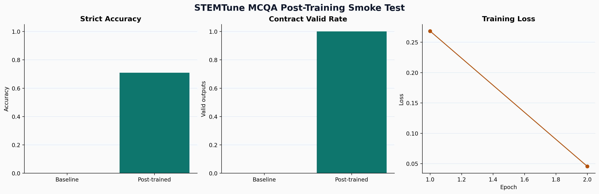

# STEMTune

`STEMTune` is a lightweight framework for selecting, adapting, and evaluating open-source LLMs for STEM-style QA tasks.

It exists for a simple reason: open models are often good enough to be useful, but not yet specialized enough to be reliable. In practice, they need one or more of these steps:

- the right model choice for the task and hardware budget;
- light post-training for the target behavior;
- evidence-aware prompting or retrieval;
- evaluation that shows whether the adaptation actually helped.

STEMTune packages those steps into one repo.

## What It Does

- recommends an open model for `sft`, `mcqa`, `dpo`, `quantization`, or `rag`
- scaffolds a clean project with configs and manifests
- runs small public-dataset studies to verify improvement
- exposes the underlying training, retrieval, and compression recipes

## Why It Is Useful

Most LLM repos stop at recipes. STEMTune is opinionated about the operational path:

1. choose a model that fits the job
2. adapt it to the task
3. measure whether it improved
4. keep only the changes that survive evaluation

## Quickstart

```bash
python -m stemtune list-tasks
python -m stemtune show-task mcqa
python -m stemtune recommend --task mcqa --gpu-memory-gb 24
python -m stemtune init-project --name "Biomedical MCQA" --task mcqa --base-model Qwen/Qwen3-8B --hf-namespace your-name --output-dir ./workspaces
```

## Smoke Test: Tiny Post-Training That Improves the Model

The fastest end-to-end demo is `posttrain-mcqa`.

It runs a tiny LoRA post-training job on the public [allenai/sciq](https://hf.co/datasets/allenai/sciq) dataset and evaluates the same model before and after adaptation on a strict machine-readable MCQA contract:

```text
<final>
choice=<A|B|C|D>
source=question_only
</final>
```

Run:

```bash
python -m stemtune posttrain-mcqa \
  --train-limit 32 \
  --eval-limit 24 \
  --epochs 2 \
  --batch-size 4 \
  --learning-rate 5e-5 \
  --max-new-tokens 64 \
  --output-dir docs/results/mcqa_posttrain_smoke
```

Tracked result in this repo:

- baseline strict accuracy: `0.000`
- post-trained strict accuracy: `0.708`
- baseline contract-valid rate: `0.000`
- post-trained contract-valid rate: `1.000`

Artifacts:

- [docs/results/mcqa_posttrain_smoke/report.md](docs/results/mcqa_posttrain_smoke/report.md)
- [docs/results/mcqa_posttrain_smoke/summary.json](docs/results/mcqa_posttrain_smoke/summary.json)



## Other Built-In Evidence

- grounding benchmark: [docs/results/mcqa_grounding_qwen25_0p5b/report.md](docs/results/mcqa_grounding_qwen25_0p5b/report.md)
  `73.3% -> 95.8%` with relevant support passages
- evidence ablation: [docs/results/mcqa_evidence_study/report.md](docs/results/mcqa_evidence_study/report.md)
  mismatched support does not help, correct support does
- support budget study: [docs/results/mcqa_support_budget_qwen25_0p5b/report.md](docs/results/mcqa_support_budget_qwen25_0p5b/report.md)
  `48` support words recover full-support accuracy with lower latency

## Repo Map

- `stemtune/`: CLI and framework layer
- `training/`: SFT, MCQA, DPO, quantization, and RAG recipes
- `retrieval/`: knowledge-base preparation scripts
- `configs/`: reference configs
- `cluster/`: SLURM launchers for GPU-backed runs
- `docs/results/`: tracked benchmark artifacts

## Next Docs

- framework commands: [stemtune/README.md](stemtune/README.md)
- alignment playbook: [docs/open-source-alignment-playbook.md](docs/open-source-alignment-playbook.md)
- cluster usage: [cluster/README.md](cluster/README.md)
